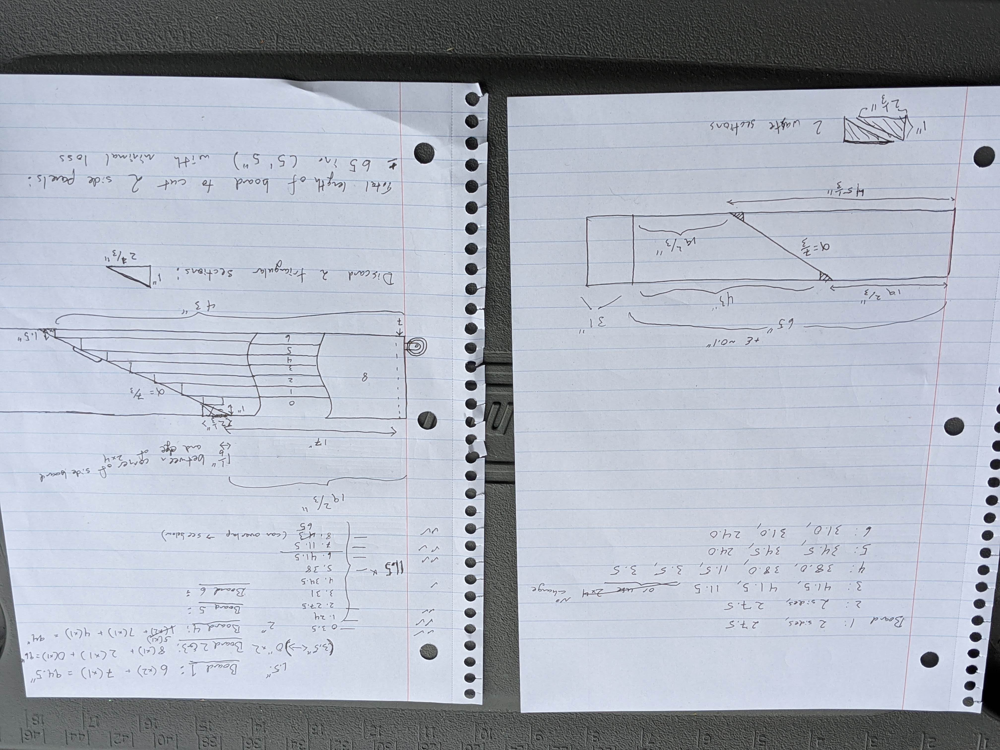
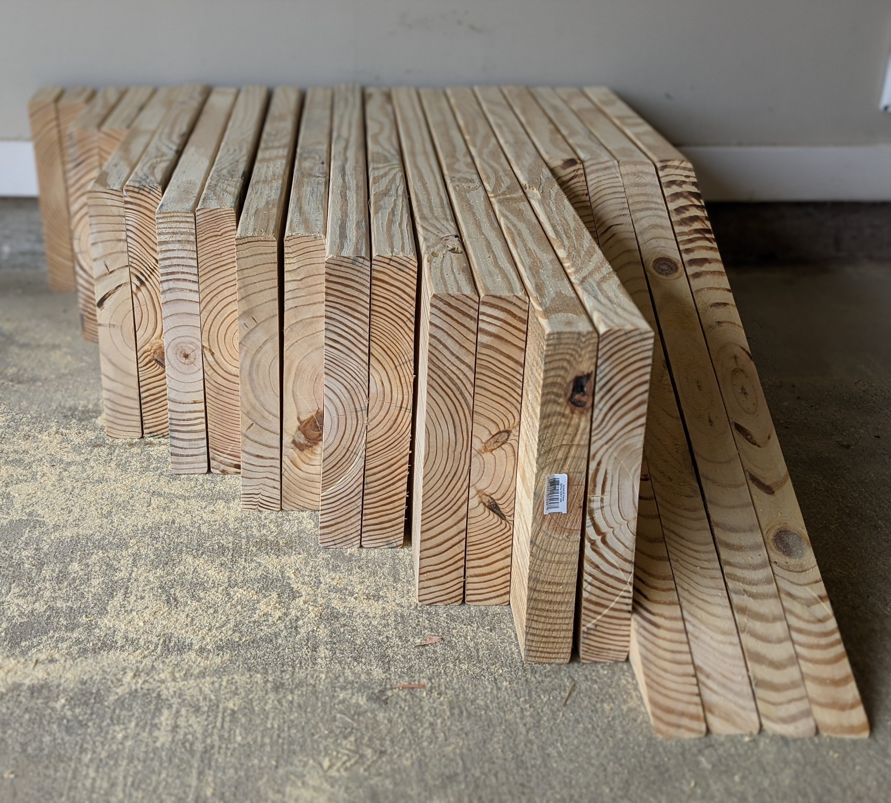
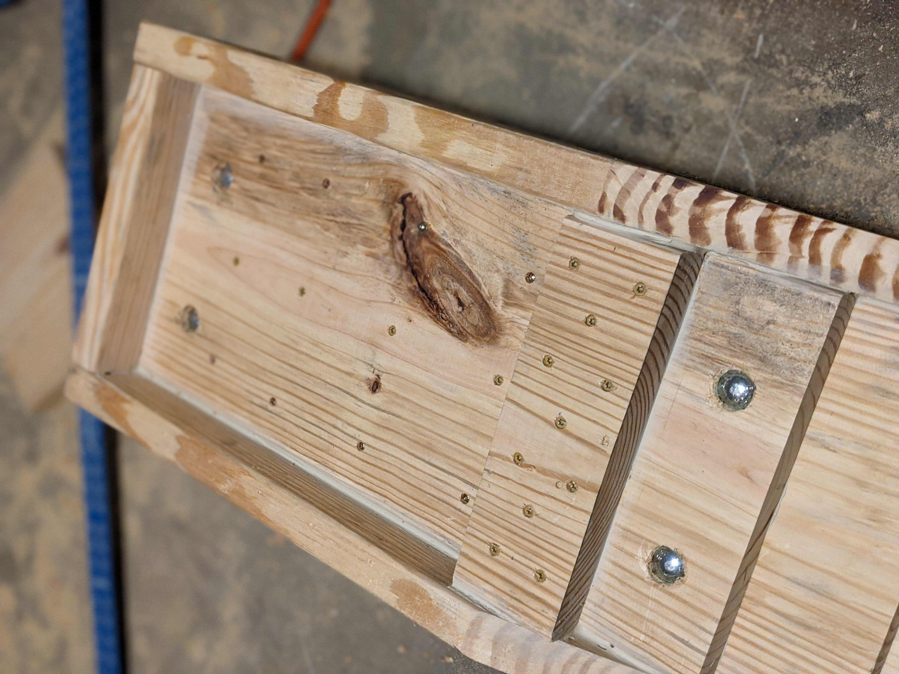

# A Practical Application of the [Bin Packing Problem](https://en.wikipedia.org/wiki/Bin_packing_problem)

I started this project because I needed some ramps for working on my vehicles, and I didn't like the ones available at the stores nearby. I knew about shipyard usage of wooden blocks for [cribbing](https://en.wikipedia.org/wiki/Box_crib) vessels while they are in dry dock, and since I work for an engineering research laboratory, I knew about the [mechanical properties of wood](https://www.conradfp.com/pdf/ch4-Mechanical-Properties-of-Wood.pdf) used in engineering projects. To that end, I decided to build my own ramps out of successively shorter strips of dimensional lumber.

After designing the ramps, I calculated how long each cut would need to be. However, I wasn't sure how to *efficiently* make the cuts in the lumber using the fewest boards possible, hence I wrote this program after drafting the plans but before visiting the lumber store. In the end, the program worked perfectly, and I ended the project with very little wasted lumber (which I kept for future projects).

## Photos

Below are some photos from the project. I took about a hundred photos throughout the entire construction phase, but limited it to three here since the point isn't to show you how to build a set of ramps, but instead to demonstrate the usefulness of knowing how to program even in daily life.

